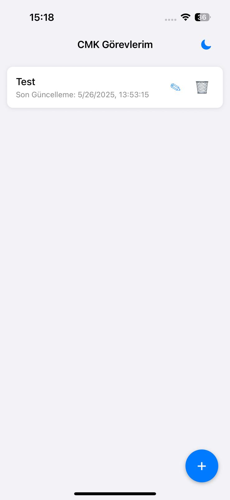
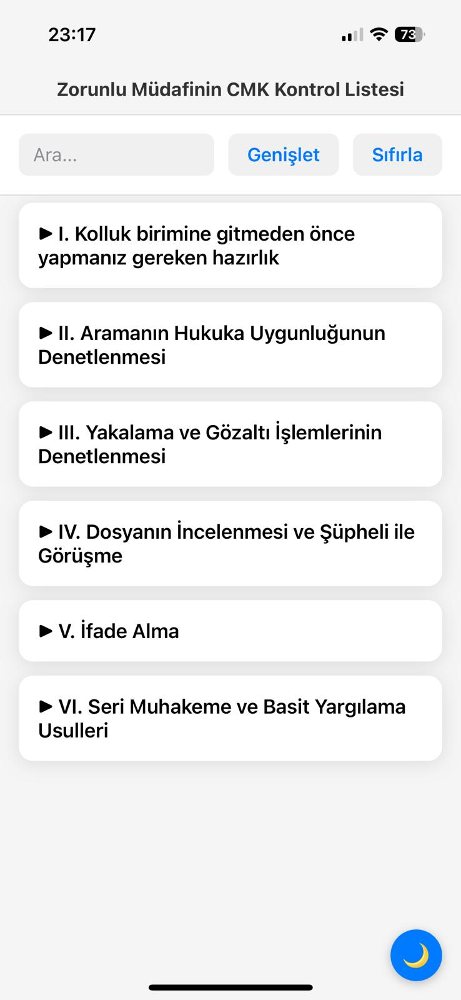
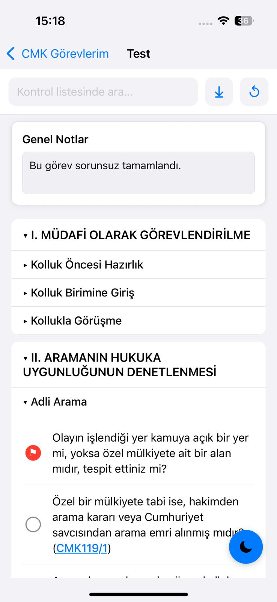
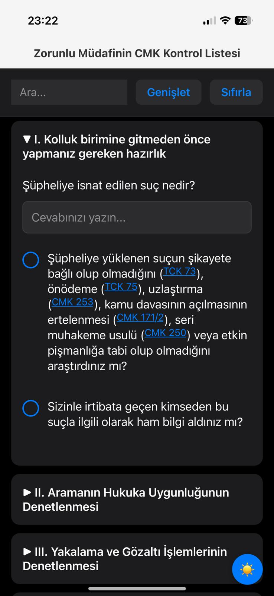
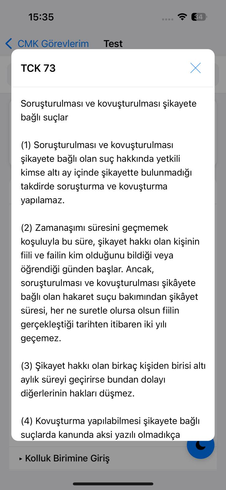

# ⚖️ CMK Kontrol Listesi Uygulaması
**Zorunlu Müdafinin (CMK) Görev Takip Listesi**

Avukatların, Ceza Muhakemesi Kanunu (CMK) dosyalarına ilişkin kritik adımları ve soruları etkin bir şekilde yönetmelerine ve takip etmelerine yardımcı olmak için React Native ve Expo ile geliştirilmiş bir mobil uygulamadır. Her dava (görev) kendi kontrol listesine sahiptir.

**Avukathakleri.net** (https://www.avukathakleri.net/zorunlu-mudafinin-cmk-kontrol-listesi/) tarafından paylaşılan kontrol listesine dayanmaktadır.

---

## ✨ Özellikler

Bu uygulama, bir CMK dosyasının aşamalarında hiçbir kritik adımın atlanmamasını sağlamak için yardımcı bir yol sunar; aynı anda birden fazla dosyanın yönetilmesine olanak tanır.

**Mevzuat Entegrasyonu:**

*   **Etkileşimli Hukuki Referanslar:** Sorular içindeki Türk yasa maddelerinin (TCK, CMK, PVSK) üzerine dokunun.
*   **Hızlı Referans Pop-up'ları:** Bir modal pop-up'ta ilgili madde metnine anında erişim sağlayın.

**Veri Yönetimi:**

*   **Sıfırlama İşlevi:** Belirli bir dava için tüm yanıtları kolayca temizleyin.
*   **Dava Silme:** Tüm dava kontrol listelerini kaldırın.
*   **Dava Yeniden Adlandırma:** Bir davanın adını güncelleyin.
*   **Yerel Depolama:** Güvenilir yerel veri kalıcılığı için `AsyncStorage` kullanır.

---

## 📸 Ekran Görüntüleri

Uygulamayı çalışırken görün:

### Ana Ekran (Dava Listesi)


### Ana Kontrol Listesi Arayüzü


### Kategori Görünümü ve Genişletme


### Koyu Mod Desteği


### Hukuki Referanslar Pop-up'ı


---

## 🚀 Başlarken

Uygulamayı yerel makinenizde geliştirme veya test amacıyla çalıştırmak için aşağıdaki adımları izleyin.

**Ön Koşullar:**

*   [Node.js](https://nodejs.org/en/) (v14 veya üzeri önerilir)
*   [npm](https://www.npmjs.com/) veya [Yarn](https://yarnpkg.com/)
*   iOS veya Android cihazınızda yüklü [Expo Go uygulaması](https://expo.dev/client)

**Kurulum:**

1.  Depoyu klonlayın:
    ```bash
    git clone https://github.com/emreterzi/cmk-checklist.git # Eğer farklıysa kendi repo URL'nizle değiştirin
    cd cmk-checklist
    ```

2.  Bağımlılıkları yükleyin:
    ```bash
    npm install
    # veya
    # yarn install
    ```

3.  Expo geliştirme sunucusunu başlatın:
    ```bash
    npx expo start
    # veya
    # yarn start
    ```

4.  Mobil cihazınızdaki Expo Go uygulamasını açın ve terminalde veya açılan tarayıcı penceresinde gösterilen QR kodu tarayın. Uygulama cihazınıza yüklenecektir.

---

## 🏗️ Proje Yapısı

Proje standart bir React Native/Expo yapısını takip eder:

```
cmk-checklist/
├── assets/                 # Uygulama ikonları ve açılış ekranı
├── docs/                   # Ekran görüntüleri dahil dokümantasyon
├── scripts/                # Veri işleme için Python betikleri
│   ├── law_parser.py       # Hukuk HTML dosyalarını ayrıştırma betiği
│   ├── scrape_laws.py      # Hukuk içeriğini kazıma betiği
│   └── README.md           # Betikler için dokümantasyon
├── src/
│   ├── data/               # Kontrol listesi öğeleri ve yasal referanslar için ham veri
│   │   ├── checklist.json      # Ana kontrol listesi yapısı
│   │   ├── index.ts            # Diğer dosyalardaki verileri dışa aktarır
│   │   ├── legalReferences.json    # Ayrıştırılmış yasal madde içeriği
│   │   ├── legalReferences_updated.json # Güncellenmiş yasal referanslar
│   │   └── laws_content/       # Hukuk içeriğinin HTML dosyaları
│   ├── hooks/              # Özel React hook'ları
│   │   └── useChecklist.ts # Tüm kontrol listesi verilerini ve işlemlerini yönetir
│   ├── screens/            # Ana uygulama ekranları
│   │   ├── HomeScreen.tsx      # Birden fazla kontrol listesini (dava) yönetme ekranı
│   │   └── ChecklistScreen.tsx # Bireysel kontrol listesi etkileşimi için ekran
│   └── types/              # TypeScript tür tanımları
│       └── index.ts            # Uygulamanın temel veri yapılarını tanımlar
├── .gitignore              # Git tarafından yok sayılan dosyalar
├── app.json                # Expo yapılandırma dosyası
├── App.tsx                 # Kök bileşen, navigasyonu kurar
├── index.ts                # Expo için giriş noktası
├── package.json            # Proje bağımlılıkları ve betikleri
├── README.md               # Bu dosya
├── requirements.txt        # Python bağımlılıkları
└── tsconfig.json           # TypeScript yapılandırması
```
*`useChecklist.ts` hook'u, yanıtları ve notları dahil olmak üzere birden çok `CaseChecklist` örneğini yönetmede merkezi bir rol oynar.*

---

## 🙏 Teşekkürler

Bu uygulamanın temelini oluşturan kapsamlı CMK kontrol listesini sağladığı için **avukathakleri.net**'e büyük teşekkürler.

---

## 🤝 Katkıda Bulunma

Katkılarınız memnuniyetle karşılanır! İyileştirme önerileriniz varsa, bir hata bulursanız veya yeni bir özellik eklemek isterseniz, lütfen bir `issue` açın veya bir `pull request` gönderin.

---

## 📄 Lisans

MIT Lisansı altında dağıtılmıştır. Daha fazla bilgi için `LICENSE` dosyasına (veya aşağıdaki metne) bakın.

```
MIT License

Permission is hereby granted, free of charge, to any person obtaining a copy of this software and associated documentation files (the "Software"), to deal in the Software without restriction, including without limitation the rights to use, copy, modify, merge, publish, distribute, sublicense, and/or sell copies of the Software, and to permit persons to whom the Software is furnished to do so, subject to the following conditions:

The above copyright notice and this permission notice shall be included in all copies or substantial portions of the Software.

THE SOFTWARE IS PROVIDED "AS IS", WITHOUT WARRANTY OF ANY KIND, EXPRESS OR IMPLIED, INCLUDING BUT NOT LIMITED TO THE WARRANTIES OF MERCHANTABILITY, FITNESS FOR A PARTICULAR PURPOSE AND NONINFRINGEMENT. IN NO EVENT SHALL THE AUTHORS OR COPYRIGHT HOLDERS BE LIABLE FOR ANY CLAIM, DAMAGES OR OTHER LIABILITY, WHETHER IN AN ACTION OF CONTRACT, TORT OR OTHERWISE, ARISING FROM, OUT OF OR IN CONNECTION WITH THE SOFTWARE OR THE USE OR OTHER DEALINGS IN THE SOFTWARE.
```

---

## 📧 İletişim

*   https://www.linkedin.com/in/emreterzi/