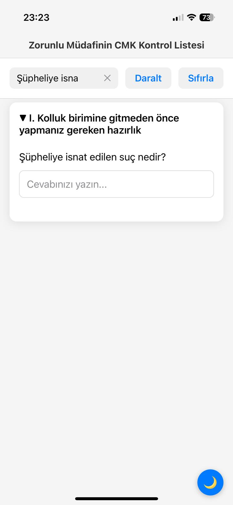

# ⚖️ CMK Checklist App

**Zorunlu Müdafinin Ceza Muhakemesi Kanunu (CMK) Kontrol Listesi**

A mobile application built with React Native and Expo designed to help lawyers, specifically mandatory defenders in Turkey, effectively manage and track crucial steps and questions related to Criminal Procedure Law (CMK) cases.

Based on the valuable checklist created by **avukathakleri.net** (https://www.avukathaklari.net/zorunlu-mudafinin-cmk-kontrol-listesi/).

---

## ✨ Features

This app provides a structured and persistent way to ensure no critical step is missed during the initial stages of a criminal defense case.

**Core Functionality:**

*   **Extensive Checklist:** Navigate through 141 detailed checklist items organized into 6 logical categories covering key aspects from pre-interview preparation to specific procedural steps (like Search, Detention, Interrogation, Seri Muhakeme, etc.).
*   **Flexible Responses:** Answer Yes/No questions with a simple toggle and provide detailed notes or responses using text input fields.
*   **Automatic Progress Saving:** All your answers and notes are automatically saved as you input them, ensuring you never lose your progress.
*   **Persistent Data:** Your completed and ongoing checklists are stored locally on your device, allowing you to pick up exactly where you left off, even after closing the app.

**User Interface & Experience:**

*   **Clean & Intuitive Design:** A minimalist interface following modern mobile design principles for ease of use, especially in potentially stressful situations.
*   **Dark Mode Support:** Reduce eye strain and improve readability in low-light environments. Toggle between light and dark themes seamlessly.
*   **Expandable Categories:** Easily collapse or expand checklist categories to focus on relevant sections.
*   **Bulk Toggle:** Expand or collapse all categories at once for quick overview or detailed browsing.

**Search & Navigation:**

*   **Real-time Search:** Quickly find specific questions or topics within the checklist by typing keywords.
*   **Text Highlighting:** Search results are visually highlighted directly in the question text.
*   **Automatic Expansion:** Categories containing search matches are automatically expanded for immediate visibility.

**Legal Terms Integration:**

*   **Interactive Legal References:** Tap on mentions of key Turkish legal codes and articles (like TCK, CMK, PVSK with specific article numbers) embedded within the questions.
*   **Quick Reference Popups:** Get instant access to detailed explanations or the relevant article text in a convenient modal popup without leaving the checklist.

**Data Management:**

*   **Full Reset Functionality:** Easily clear all answers and start fresh for a new case with a confirmation prompt.
*   **Local Storage:** Utilizes `AsyncStorage` for reliable and simple local data persistence.

---

## 📸 Screenshots

See the app in action:

| Main Interface                                  | Category View with Expansion                        | Search Functionality                                |
| :---------------------------------------------- | :-------------------------------------------------- | :-------------------------------------------------- |
|  |  |  |

| Dark Mode Support                           | Legal References Popup                                |
| :------------------------------------------ | :---------------------------------------------------- |
|  |  |

---

## 🚀 Getting Started

Follow these steps to get the application up and running on your local machine for development or testing purposes.

**Prerequisites:**

*   [Node.js](https://nodejs.org/en/) (v14 or higher recommended)
*   [npm](https://www.npmjs.com/) or [Yarn](https://yarnpkg.com/)
*   [Expo Go app](https://expo.dev/client) installed on your iOS or Android device

**Installation:**

1.  Clone the repository:
    ```bash
    git clone https://github.com/YOUR_GITHUB_USERNAME/cmk-checklist.git # Replace with your repo URL
    cd cmk-checklist
    ```

2.  Install dependencies:
    ```bash
    npm install
    # or
    # yarn install
    ```

3.  Start the Expo development server:
    ```bash
    npx expo start
    # or
    # yarn start
    ```

4.  Open the Expo Go app on your mobile device and scan the QR code displayed in the terminal or browser window that opens. The app should load on your device.

---

## 🏗️ Project Structure

The project follows a standard React Native/Expo structure:

```
cmk-checklist/
├── assets/                 # App icons and splash screen
├── docs/                   # Documentation, including screenshots
├── src/
│   ├── data/               # Raw data for checklist items and legal references
│   │   ├── checklist.ts
│   │   └── legalReferences.ts
│   ├── hooks/              # Custom React hooks (e.g., for data fetching/persistence)
│   │   └── useChecklist.ts # Note: Current implementation uses useState/useEffect directly in screen
│   ├── screens/            # Main application screens
│   │   └── ChecklistScreen.tsx
│   └── types/              # TypeScript type definitions
│       └── index.ts
├── .gitignore              # Files ignored by Git
├── app.json                # Expo configuration file
├── App.tsx                 # Root component, sets up navigation
├── index.ts                # Entry point for Expo
├── package.json            # Project dependencies and scripts
├── README.md               # This file
└── tsconfig.json           # TypeScript configuration
```

*Note: The `useChecklist.ts` hook exists but is not currently utilized by `ChecklistScreen.tsx`. State management (answers, notes) is handled directly within the screen component.*

---

## 🗺️ Roadmap

Ideas for future enhancements and features:

*   [ ] Implement a Floating Action Button (FAB) for quick navigation between categories.
*   [ ] Explore adding swipe gestures for certain interactions (e.g., marking as done).
*   [ ] Refactor state management, potentially utilizing the `useChecklist` hook or a more centralized approach.
*   [ ] Improve the legal reference lookup to handle variations (e.g., "TCK m. 73").
*   [ ] Add export functionality (e.g., export completed checklist as PDF/text).
*   [ ] Implement progress indicators (e.g., percentage complete per category).

---

## 🙏 Acknowledgements

A huge thank you to **avukathakleri.net** for providing the comprehensive CMK checklist that serves as the foundation for this application.

---

## 🤝 Contributing

Contributions are welcome! If you have suggestions for improvements, find a bug, or want to add a new feature, please open an issue or submit a pull request.

---

## 📄 License

Distributed under the MIT License. See `LICENSE` file (or the text below) for more information.

```
MIT License

Permission is hereby granted, free of charge, to any person obtaining a copy of this software and associated documentation files (the "Software"), to use, copy, modify, merge, publish, distribute, sublicense, and/or sell copies of the Software, subject to the following conditions:

This license notice must be included in all copies or substantial portions of the Software.

THE SOFTWARE IS PROVIDED "AS IS", WITHOUT WARRANTY OF ANY KIND, EXPRESS OR IMPLIED, INCLUDING BUT NOT LIMITED TO THE WARRANTIES OF MERCHANTABILITY, FITNESS FOR A PARTICULAR PURPOSE, AND NONINFRINGEMENT.
```

---

## 📧 Contact

Feel free to reach out via:

*   https://www.linkedin.com/in/emreterzi/